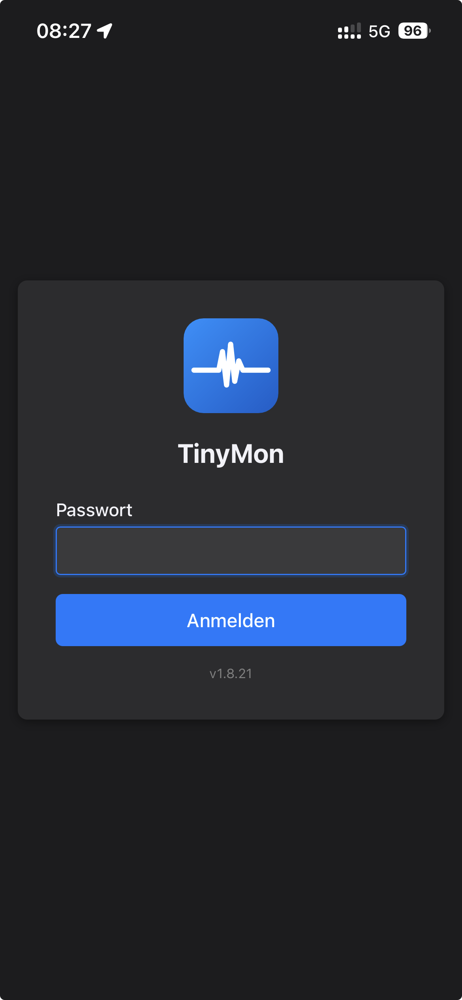
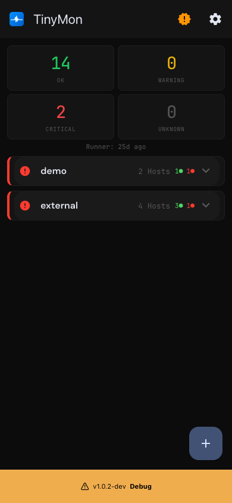
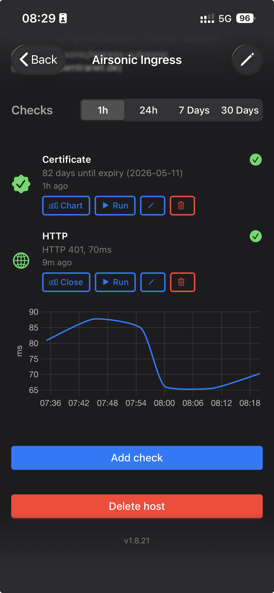
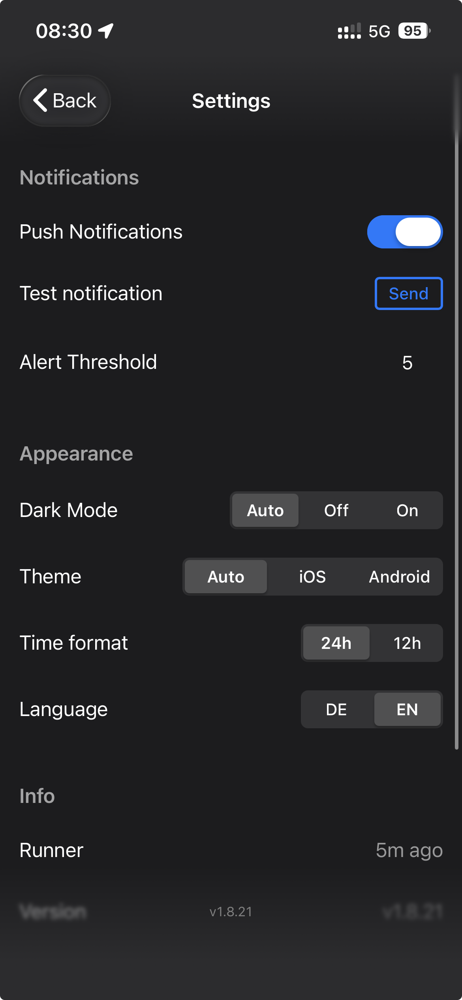

<p align="center">
  
</p>

<h1 align="center">TinyMon</h1>

<p align="center">
  <strong>The minimalist alternative to Prometheus, Nagios & Co.</strong><br>
  Pull checks. Push API. One SQLite file. Zero overhead.<br><br>
  <a href="https://demo.p-q8g5ns.project.space/backend"><strong>Live Demo</strong></a> (password: <code>demo</code>)
</p>

---

TinyMon monitors your servers and services without the complexity of a full monitoring stack. It combines **pull-based checks** (ping, HTTP, certificates, ...) with a **push API** for external systems like Kubernetes, cronjobs, or CI pipelines -- all in a single lightweight application.

## Why PHP?

TinyMon is written in PHP on purpose. It runs on any cheap shared hosting provider -- no Docker, no VPS, no Node.js runtime required. A 3 EUR/month PHP hoster with SQLite and a cronjob is all you need. That makes it the cheapest possible monitoring setup for small teams, freelancers, and side projects.

## Why not Prometheus, Zabbix, or Nagios?

| | Prometheus | Zabbix | Nagios | **TinyMon** |
|---|---|---|---|---|
| Database | TimescaleDB / remote storage | PostgreSQL / MySQL | Flat files | **SQLite** |
| Agents required | Exporters on every target | Zabbix Agent | NRPE / NSCA | **None** |
| Configuration | YAML files, relabeling | Web UI + templates | Config files | **Web UI** |
| Setup time | Hours | Hours | Hours | **Minutes** |
| Push support | Pushgateway (extra component) | Active checks | NSCA (extra daemon) | **Built-in REST API** |
| IaC support | Native (config files) | API / Terraform | Config files | **Terraform Provider** |
| Alerting | Alertmanager (extra component) | Built-in (complex) | Config files | **Built-in (email + browser push)** |

TinyMon is not a replacement for enterprise monitoring. It is designed for a manageable number of hosts and checks -- not for hundreds of targets with high-frequency scraping. If you need that, Prometheus or Zabbix are the right choice. TinyMon is the right tool when a full stack is overkill -- for small teams, homelabs, side projects, freelancers, and shared hosting.

## Pull & Push -- One Dashboard

### Pull Checks

TinyMon actively monitors your infrastructure via a cronjob runner:

- **Ping** -- ICMP with TCP fallback (works on shared hosting)
- **HTTP/HTTPS** -- status code, response time, SSL verification
- **TCP Port** -- connect time
- **SSL Certificate** -- days until expiry
- **Content** -- expected/unexpected strings on a page
- **Content Hash** -- detect changes (SHA-256)
- **Disk / Load / Memory** -- local system resources
- **Disk Health** -- S.M.A.R.T. health status and temperature (push-only)

Each check has configurable **warning** and **critical** thresholds.

### Push API

External systems push results to TinyMon via REST API with bearer token auth:

```bash
# Push a check result from a cronjob, CI pipeline, or K8s operator
curl -X POST https://mon.example.com/api/push/results \
  -H "Authorization: Bearer $API_KEY" \
  -H "Content-Type: application/json" \
  -d '{"host_address": "10.0.1.5", "check_type": "backup", "status": "ok", "value": 42, "message": "Backup completed in 42s"}'
```

Hosts and checks are created automatically on first push (upsert by address + type). Bulk endpoint available for submitting multiple results at once. Push results can include a `config` field to distinguish multiple checks of the same type (e.g. multiple disk mounts on one host).

Use cases:
- **Kubernetes** -- an operator pushes node/pod health
- **Cronjobs** -- report success/failure after each run
- **CI/CD** -- push deployment status
- **IoT / Edge** -- devices report their own metrics

Pull and push results appear side by side in the same dashboard.

## Alerting

TinyMon notifies you when a check changes status (ok / warning / critical):

- **Email** via SMTP -- configurable recipients
- **Browser Push** via VAPID -- works on iOS, Android, and desktop

Alerts fire only on **status transitions** -- no repeated spam while something is down.

## Dashboard

- Mobile-first SPA (Framework7, iOS-style)
- Status overview across all hosts at a glance
- Charts per check (24h, 7d, 30d) with threshold zones
- Dark mode (auto / on / off)
- Multi-language (EN / DE)
- PWA-ready, pull-to-refresh

## Screenshots

<p align="center">
  
  
  
  
</p>

> **Try it yourself:** [Live Demo](https://demo.p-q8g5ns.project.space/backend) -- password: `demo`. The demo resets daily.

## Getting Started

### Option A: Docker

```bash
git clone https://github.com/unclesamwk/TinyMon.git
cd TinyMon
cp .env.example .env
# Edit .env: set ADMIN_PASSWORD, SMTP credentials, etc.
docker compose up -d
```

Open `http://localhost:8001/backend` and log in.

Add a cronjob for the check runner (inside or outside the container):

```bash
# Outside
* * * * * cd /path/to/TinyMon && docker compose exec -T app php bin/runner.php >> data/runner.log 2>&1

# Or inside the container
* * * * * php /var/www/html/bin/runner.php >> /var/www/html/data/runner.log 2>&1
```

### Option B: Kubernetes (Helm)

```bash
helm repo add tinymon https://unclesamwk.github.io/TinyMon
helm repo update
helm install tinymon tinymon/tinymon --set adminPassword=changeme
```

The chart deploys the web app, a CronJob for the check runner, and a PersistentVolumeClaim for the SQLite database. Configure via `values.yaml`:

```bash
helm show values tinymon/tinymon
```

Common overrides:

```bash
helm install tinymon tinymon/tinymon \
  --set adminPassword=secret \
  --set ingress.enabled=true \
  --set ingress.hosts[0].host=mon.example.com \
  --set ingress.hosts[0].paths[0].path=/ \
  --set ingress.hosts[0].paths[0].pathType=Prefix \
  --set smtp.host=smtp.example.com \
  --set smtp.user=user \
  --set smtp.password=pass \
  --set alertRecipients=admin@example.com
```

The Docker image (`unclesamwk/tinymon`) supports **amd64** and **arm64**.

### Option C: Shared Hosting / Bare Metal

Requirements: PHP 8.3+, Composer, SQLite, Apache with `mod_rewrite`.

```bash
git clone https://github.com/unclesamwk/TinyMon.git
cd TinyMon
cp .env.example .env
# Edit .env
composer install --no-dev --optimize-autoloader
```

Point your document root to the project root. The `.htaccess` handles routing to `public/` and blocks access to `app/`, `vendor/`, `data/`, and `.env`.

On hosts where the document root must be `public/`, point it there directly -- the `public/.htaccess` handles the rest.

Set up the runner cronjob:

```bash
* * * * * cd /path/to/TinyMon && php bin/runner.php >> data/runner.log 2>&1
```

Open `https://your-domain.com/backend` and log in.

### Enable Push API

Set `PUSH_API_KEY` in `.env`, then push results from anywhere:

```bash
# Single result
curl -X POST https://mon.example.com/api/push/results \
  -H "Authorization: Bearer $API_KEY" \
  -H "Content-Type: application/json" \
  -d '{"host_address": "web-1", "check_type": "http", "status": "ok", "value": 120, "message": "200 OK, 120ms"}'

# Bulk (multiple results in one request)
curl -X POST https://mon.example.com/api/push/bulk \
  -H "Authorization: Bearer $API_KEY" \
  -H "Content-Type: application/json" \
  -d '{"results": [
    {"host_address": "web-1", "check_type": "memory", "status": "ok", "value": 62.5, "message": "62.5%"},
    {"host_address": "web-1", "check_type": "disk", "status": "ok", "value": 20, "message": "20% used", "config": {"mount": "/"}},
    {"host_address": "web-1", "check_type": "disk", "status": "ok", "value": 45, "message": "45% used", "config": {"mount": "/data"}}
  ]}'

# Create/update hosts and checks programmatically
curl -X POST https://mon.example.com/api/push/hosts \
  -H "Authorization: Bearer $API_KEY" \
  -H "Content-Type: application/json" \
  -d '{"name": "k8s-node-1", "address": "10.0.1.5"}'
```

The `config` field in bulk push results allows multiple checks of the same type per host. Checks are matched by `host_address` + `check_type` + `config`. If no matching check exists, it is auto-created.

## Terraform Provider

For non-Kubernetes infrastructure (VPS, bare metal, IoT, homelabs), the [Terraform Provider](https://github.com/unclesamwk/terraform-provider-tinymon) lets you manage hosts and checks as code:

```hcl
provider "tinymon" {
  url     = "https://mon.example.com"
  api_key = var.tinymon_api_key
}

resource "tinymon_host" "nas" {
  name        = "NAS"
  address     = "192.168.1.50"
  description = "Synology DS920+"
  topic       = "home/storage"
}

resource "tinymon_check" "nas_ping" {
  host_address = tinymon_host.nas.address
  type         = "ping"
}

resource "tinymon_check" "nas_http" {
  host_address     = tinymon_host.nas.address
  type             = "http"
  interval_seconds = 60
}
```

The provider uses the Push API to create, update, and delete hosts and checks. Full documentation and installation instructions are in the [provider repository](https://github.com/unclesamwk/terraform-provider-tinymon).

## Configuration

All settings via `.env`:

| Variable | Description |
|----------|-------------|
| `ADMIN_PASSWORD` | Login password |
| `SMTP_HOST/PORT/USER/PASSWORD` | SMTP for email alerts |
| `ALERT_RECIPIENTS` | Comma-separated recipients |
| `PUSH_API_KEY` | Bearer token for Push API (empty = disabled) |
| `VAPID_PUBLIC_KEY/PRIVATE_KEY` | Browser push keys (empty = auto-generate) |

The database (`data/tinymon.sqlite`) is created automatically. No migrations.

## API

Interactive API documentation is available via Swagger UI:

```
https://your-domain.com/api/docs
```

The OpenAPI spec is auto-generated from PHP attributes and always reflects the current code.

| API | Auth | Endpoints |
|-----|------|-----------|
| **Session API** `/api/*` | Cookie (login) | Dashboard, Host/Check CRUD, run checks, result history |
| **Push API** `/api/push/*` | Bearer token | Create/delete hosts/checks, push results (single + bulk, config-aware) |

## Tech Stack

- **Backend:** PHP 8.4, Flight PHP, SQLite
- **Frontend:** Framework7, Chart.js
- **Push Notifications:** minishlink/web-push (VAPID)
- **API Docs:** zircote/swagger-php (OpenAPI 3)
- **Deploy:** Docker or bare metal / shared hosting

## Kubernetes Operator

For Kubernetes clusters, the [Kubernetes Operator](https://github.com/unclesamwk/tinymon-operator) watches your cluster resources and pushes their status to TinyMon via the Push API:

| Resource | Check Type | What it reports |
|----------|-----------|-----------------|
| Nodes | `k8s_node` | Conditions (Ready, MemoryPressure, DiskPressure, PIDPressure) |
| Deployments | `k8s_deployment` | Replica availability, rollout status |
| StatefulSets | `k8s_statefulset` | Replica availability, rollout status |
| DaemonSets | `k8s_daemonset` | Scheduled vs. ready pods, misscheduled pods |
| Ingresses | `k8s_ingress` | Configuration status, TLS, load balancer assignment |
| PVCs | `k8s_pvc` | Bound status, capacity |
| CronJobs | `k8s_cronjob` | Last schedule time, active jobs, failed job detection |
| Backup schedules | `k8s_backup` | Velero backup schedule status, last backup time |

```bash
helm repo add tinymon https://unclesamwk.github.io/tinymon-operator
helm repo update

helm install tinymon-operator tinymon/tinymon-operator \
  --namespace tinymon-operator \
  --create-namespace \
  --set config.tinymonUrl=https://mon.example.com \
  --set config.pushApiKey=your-push-api-key \
  --set config.clusterName=my-cluster
```

The operator auto-discovers resources via Kubernetes informers (real-time) and periodic full syncs, pushes status updates in bulk, and creates checks in TinyMon automatically. Exclude resources with the `tinymon.io/ignore: "true"` annotation. Full documentation and configuration options in the [operator repository](https://github.com/unclesamwk/tinymon-operator).

## Docker Agent

For Docker hosts, the [Docker Agent](https://github.com/unclesamwk/tinymon-docker-agent) monitors containers via labels -- similar to how the K8s operator monitors deployments via annotations:

```yaml
services:
  tinymon-agent:
    image: unclesamwk/tinymon-docker-agent
    restart: unless-stopped
    volumes:
      - /var/run/docker.sock:/var/run/docker.sock:ro
    environment:
      TINYMON_URL: "https://mon.example.com"
      TINYMON_API_KEY: "your-push-api-key"
      AGENT_NAME: "prod-docker-01"

  web:
    image: nginx
    labels:
      tinymon.enable: "true"
      tinymon.name: "Webserver"
      tinymon.http.url: "https://example.com/health"
      tinymon.certificate.host: "example.com"
```

The agent discovers containers with `tinymon.enable=true`, pushes their status to the Push API, and optionally creates HTTP and certificate checks (pull mode). Full documentation and label reference in the [agent repository](https://github.com/unclesamwk/tinymon-docker-agent).

## Ideas

- **SSH Checks** -- Connect to remote hosts via SSH and run checks there (disk, load, memory, custom scripts). No agent required, just SSH access. Extends the pull model to remote systems.
- **TinyMon Agent** -- A lightweight agent (Go binary) that runs on the target host and pushes check results via the Push API. Works behind firewalls and NAT, configurable via local YAML or centrally from the server.

## Contributing

TinyMon is built to stay simple -- but there is always room to make it better. If you have an idea, found a bug, or want to suggest a feature, open an issue on GitHub. Pull requests are welcome too.

We'd love to hear how you use TinyMon and what would make it more useful for you. Even rough ideas or "wouldn't it be nice if..." suggestions are appreciated -- they help shape what comes next.

## Disclaimer

TinyMon is provided as-is, without warranty of any kind. Use at your own risk. The authors are not liable for any damages, data loss, or missed alerts resulting from the use of this software.

## License

[MIT](LICENSE)
